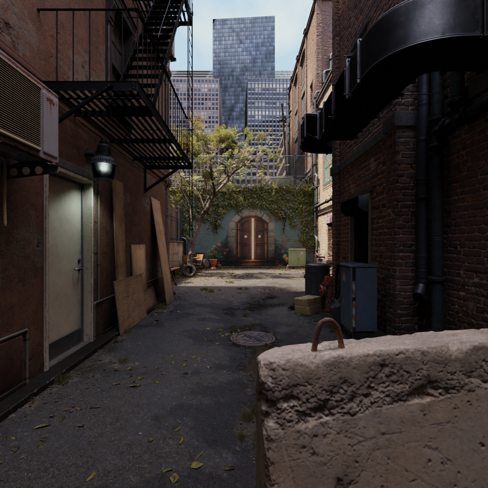
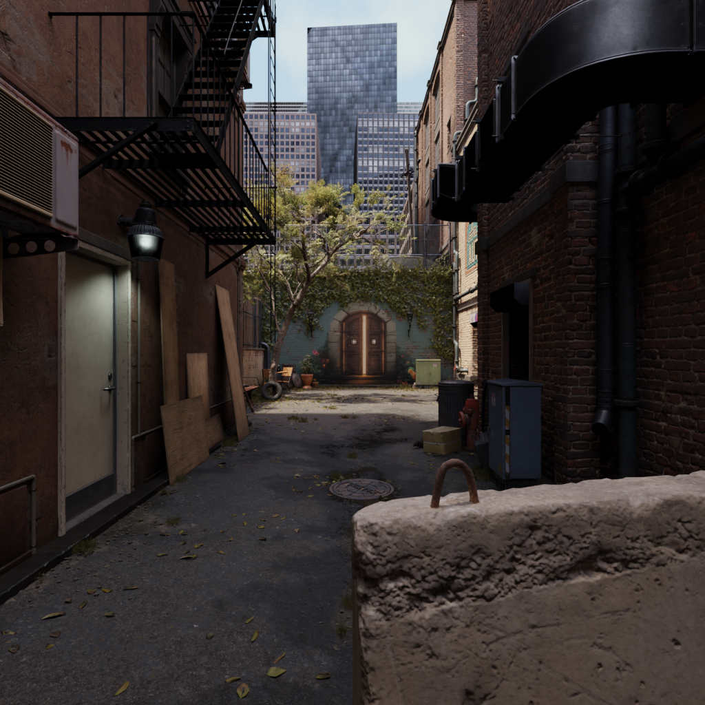
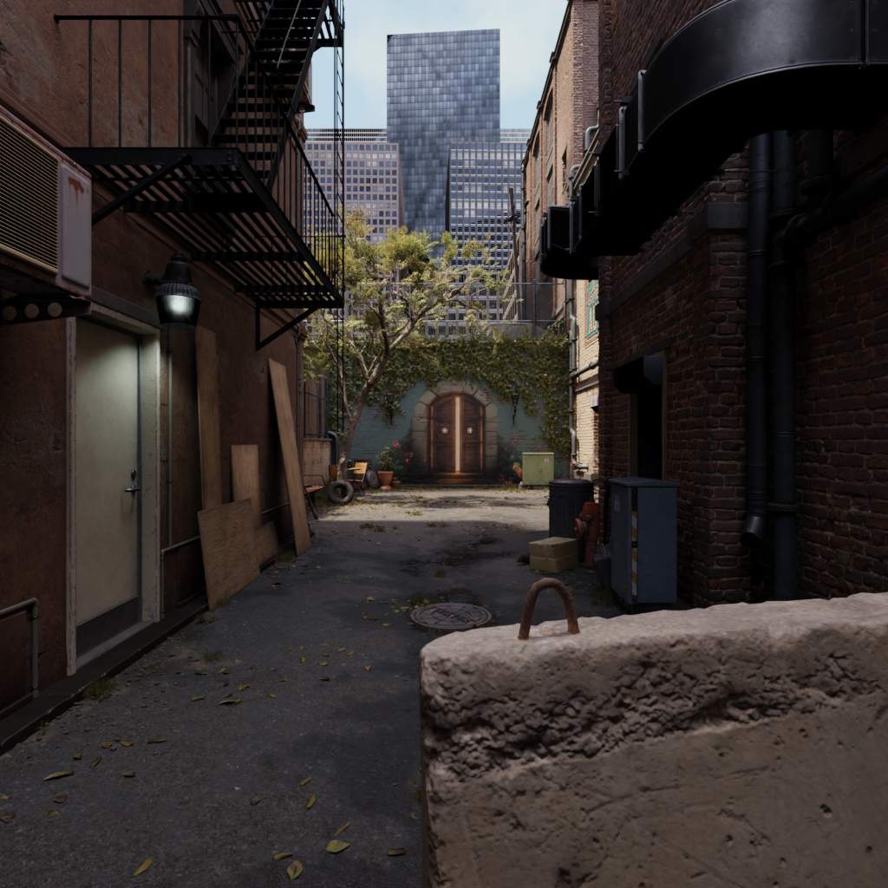
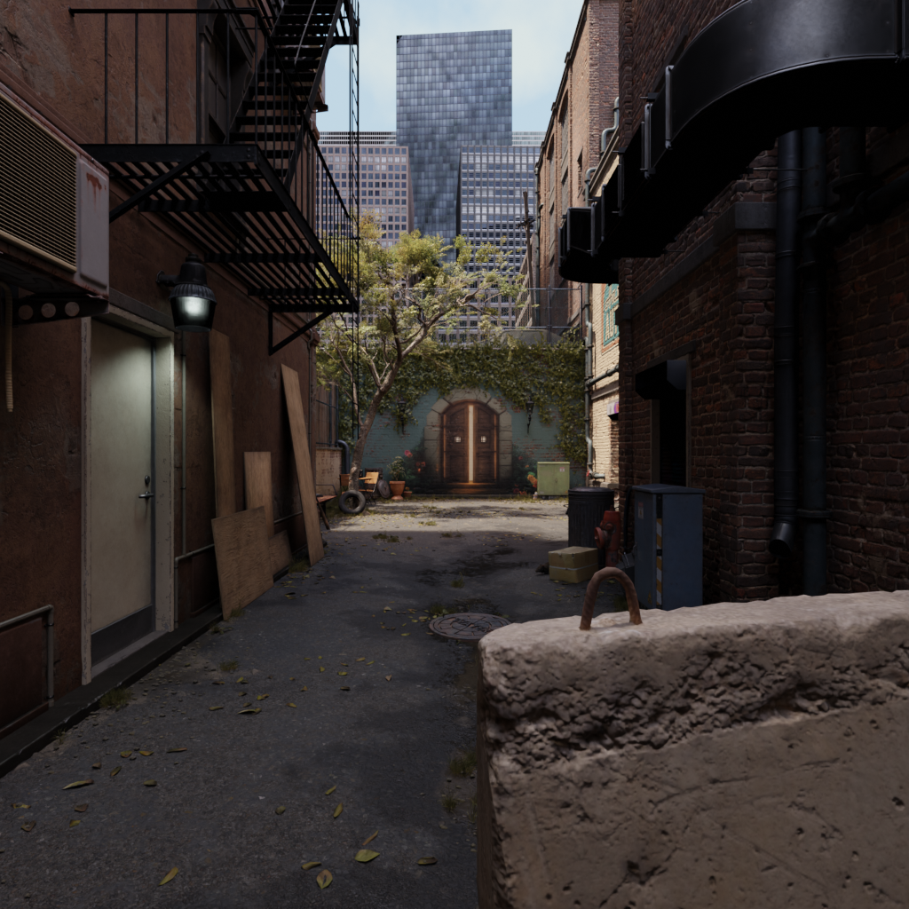
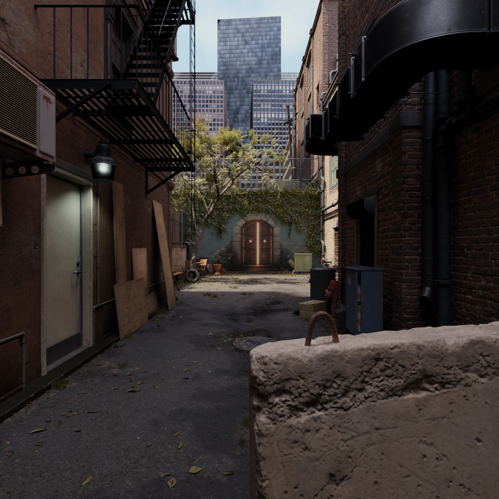
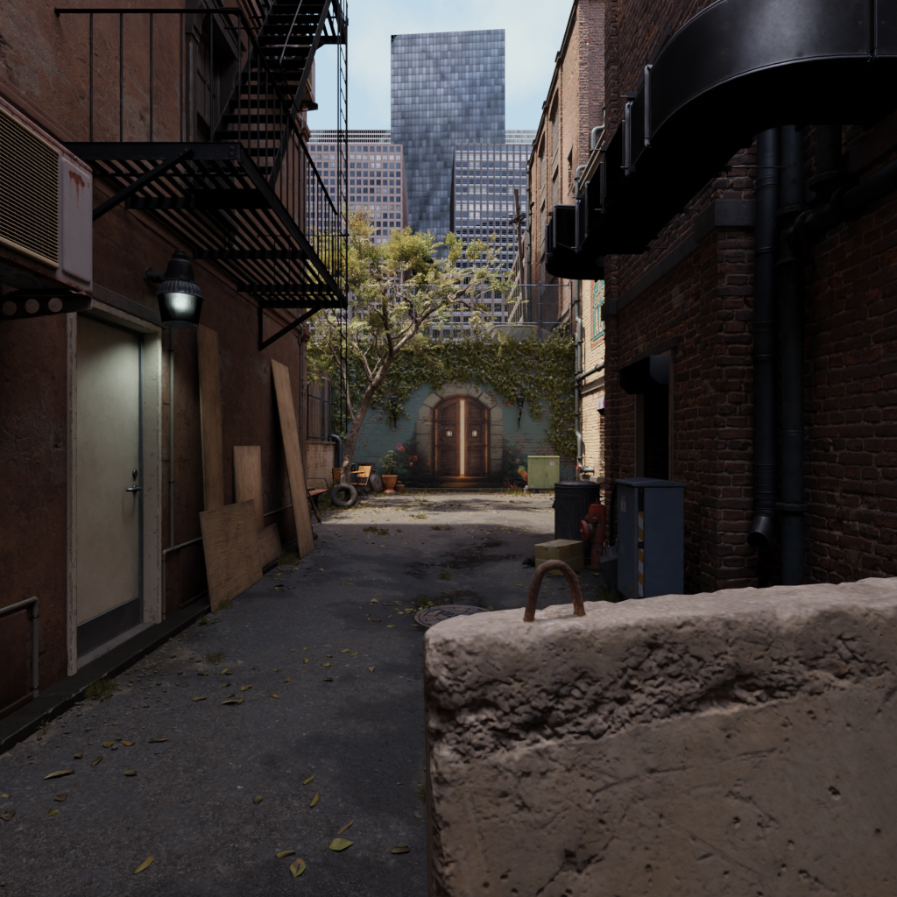
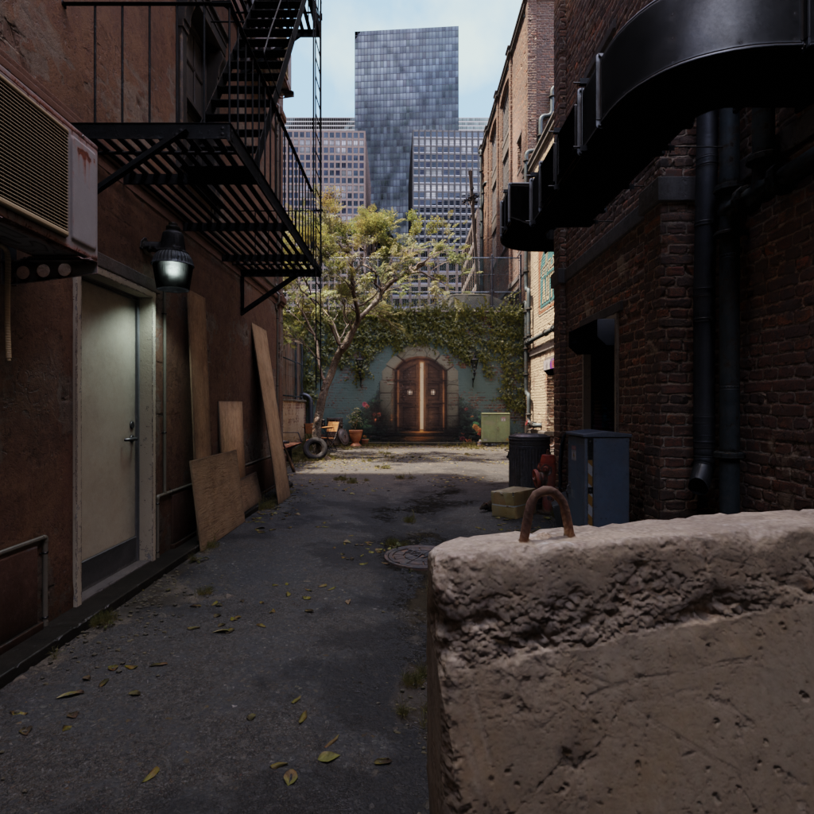
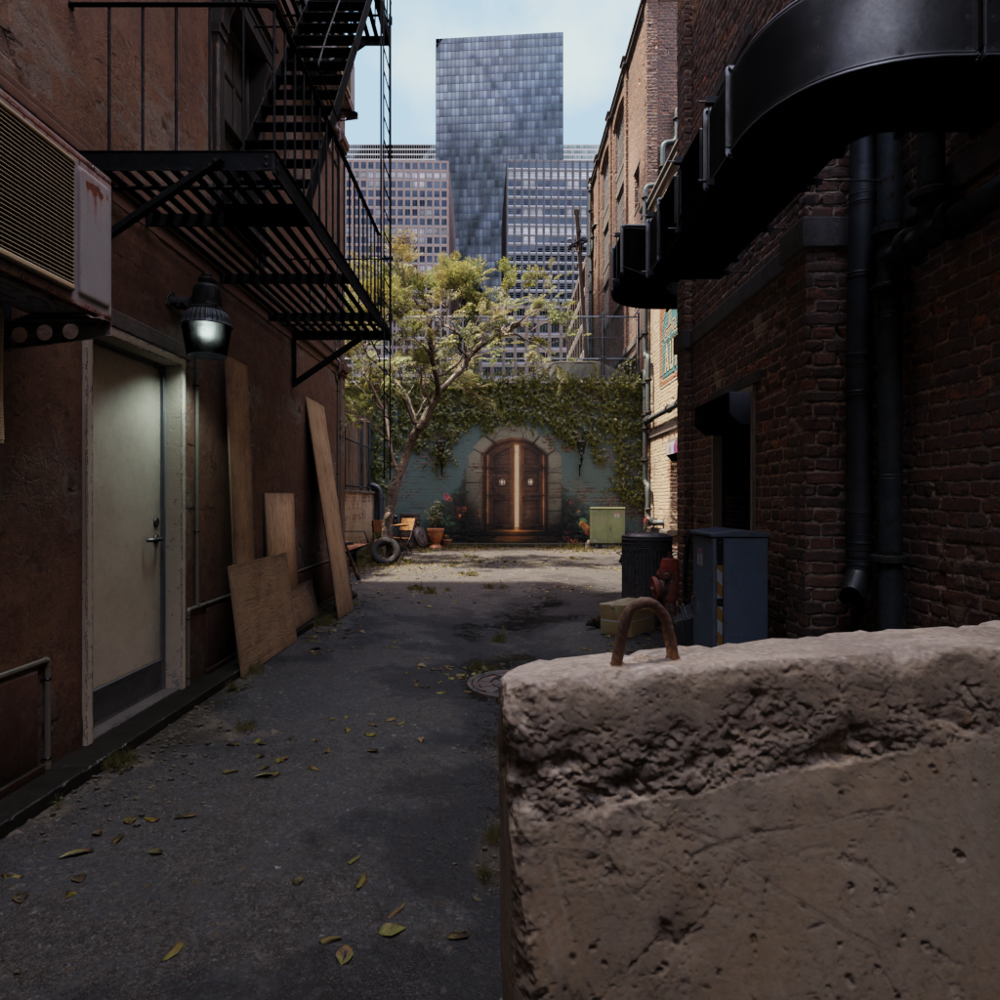
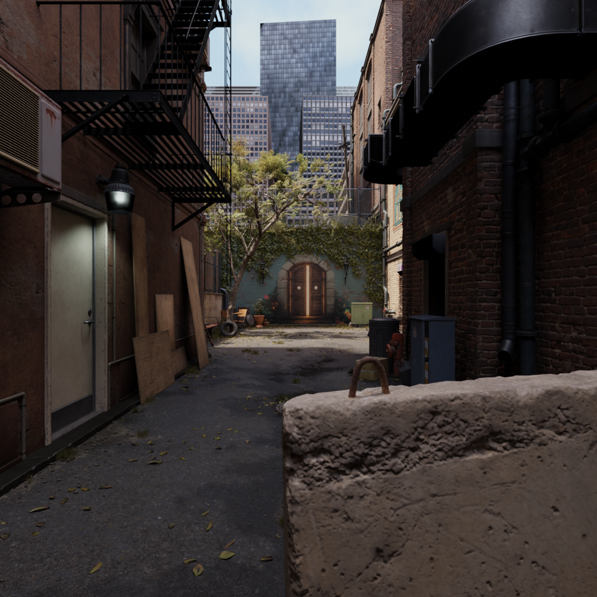

# 面向深度感知的多视角合成数据集构建系统

## 采集结果展示

以下为焦距 24 mm、阵列基线 37.5 mm 的 `3 × 3` 九视图采集结果：

<table>
  <tr>
    <td></td>
    <td></td>
    <td></td>
  </tr>
  <tr>
    <td></td>
    <td></td>
    <td></td>
  </tr>
  <tr>
    <td></td>
    <td></td>
    <td></td>
  </tr>
</table>

基于 BlenderProc 与 Blender Python API，批量加载 `.blend` 场景、构建 `rows × cols` 相机阵列，并生成 RGB-D 数据集。输出包括 `.hdf5`、RGB 图像、深度矩阵和深度可视化图。

## 目录结构

```text
project/
├── assets/                         # .blend 场景资产
│   └── <scene_name>/
│       └── <scene_file>.blend
├── utils/                          # 文件与图像处理工具
├── batch.py                        # 批量渲染
├── alley_cube.py                   # 单场景参照物测试
├── alley_parameter.py              # 单场景参数测试
├── visualization.py                # 提取 RGB 和深度矩阵
├── depth_visualization.py          # 生成深度可视化图
├── requirements.txt                # Python 依赖
├── output/                         # HDF5 渲染结果
├── output_colors/                  # RGB 图像
└── output_depths/                  # 深度矩阵及可视化图
```

将场景放入 `assets/` 下的自定义目录，例如：

```text
assets/my_scene/my_scene.blend
```

所有输入和输出路径均相对于项目根目录配置，不依赖启动脚本时的工作目录。

## 脚本说明

`batch.py` 用于加载多个场景、生成相机阵列并批量输出 RGB-D 数据。`alley_cube.py` 和 `alley_parameter.py` 用于单场景参数测试。`visualization.py` 负责提取 RGB 与深度矩阵，`depth_visualization.py` 负责生成伪彩色深度图。

## 场景与相机配置

在 `batch.py` 的 `scene_configs` 中添加场景：

```python
scene_configs = [
    {
        "blend_path": "./assets/my_scene/my_scene.blend",
        "output_dir": "./output/my_scene",
        "rows": 2,
        "cols": 3,
        "gap_mm": 37.5,
        "resolution": (1024, 1024),
        "focal_length": None,
        "center_location": None,
        "center_rotation": None,
    },
]
```

默认情况下，代码读取 `.blend` 场景活动相机的位置、旋转和焦距；没有活动相机时使用找到的第一个相机。将对应配置保持为 `None` 即继承场景参数，也可以直接填写数值进行覆盖：

```python
"focal_length": 35.0,                    # 毫米
"center_location": [0.0, -5.0, 2.0],
"center_rotation": [1.5708, 0.0, 0.0],  # XYZ 欧拉角，弧度
```

## 安装与运行

```bash
pip install -r requirements.txt
blenderproc run batch.py
python visualization.py
python depth_visualization.py
```

`bpy` 和 `mathutils` 由 Blender/BlenderProc 提供，无需单独安装。

## 相机阵列

阵列偏移基于主相机的本地坐标系计算：

```text
相机阵列（rows × cols）

[Cam(0, 0)]       ...       [Cam(0, cols - 1)]
     ⋮                              ⋮
[Cam(rows - 1, 0)] ... [Cam(rows - 1, cols - 1)]

相邻相机中心间距：gap_mm
```

| 参数 | 说明 | 默认值或来源 |
|---|---|---|
| `rows` | 阵列行数 | 2 |
| `cols` | 阵列列数 | 3 |
| `gap_mm` | 水平、垂直方向相邻相机的中心间距（mm） | 37.5 |
| `focal_length` | 焦距（mm） | 场景相机 |
| `center_location` | 阵列中心位置 `[x, y, z]` | 场景相机 |
| `center_rotation` | 阵列中心 XYZ 欧拉角（弧度） | 场景相机 |
| `resolution` | 渲染分辨率 `(width, height)` | `(1024, 1024)` |

最终视角数量为 `rows × cols`。

## 输出格式

| 目录 | 内容 |
|---|---|
| `output/<场景>/` | 含 RGB 与 Distance 的 `.hdf5` 文件 |
| `output_colors/<场景>_rgb/` | RGB `.png` 图像 |
| `output_depths/<场景>_depth/` | 深度 `.npy` 矩阵及 `*_vis.png` 可视化图 |
